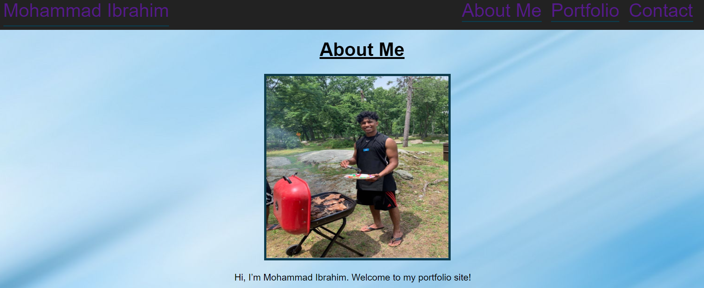

# Mohammad Ibrahim's Portfolio

## This portfolio showcases my skills from various projects I have done. In my portfolio, there is a photo of myself, an about me section which briefly describes who I am, and a contact page where you can contact me at. For this project I used semantic HTML elements and advanced CSS.

### The motivation to build this project is to help people understand who I am as a developer. I hope you enjoy viewing this project as much as I enjoyed making it!

Link to the GIT repository: https://github.com/mibrahim234/mibrahim234.github.io

Link to the Live Page: https://mibrahim234.github.io/

## Credits: Mohammad Ibrahim 